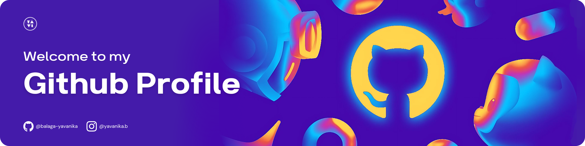

<!-- BANNER IMAGE -->

<!-- HEADING 1 -->
<h1 align="left" >
Hi there , I'm Yavanika. </h1>

<!-- HEADING 2 -->

    <h3 align="left"> A passionate Data-Enthusiaist </sub</h3>

 

<!-- PERSONAL INFO -->

     I’m currently learning: Data Skills.

     Data-Fact: The largest data center in the world, covering 6.3 million square feet, is located in Langfang, China.

 

<!-- PROFILE VIEWS -->

    

<!--

  

 -->

<!-- CONNECT WITH ME -->
<h3 align="left"> Connect with Me </h3>

    

  

 

  

<!-- TOOLS | SKILLS -->
<h3 align="left"> Languages & Skills Stack </h3>

<a href="https://skillicons.dev" target="_blank">
&nbsp;
  

</a>

<!-- -->
<h3> Developer/Forums </h3>

<!-- TROPHIES -->
<h2 align="center">
 GitHub Trophies </h2>

  

<!-- GITHUB STATS -->
<h2 align="center">
  GitHub Stats 
</h2>
<table align="center"> <!-- TABLE STATS -->
  <tr>
    <td>
    
    </td>
    <th></th>
  </tr>
    <tr>
    <td colspan="2">
  
    </td>
  </tr>
</table>

<!-- THANKS -->
<h3 align= "center">
   Thanks for swinging by my profile! 
</h3> 

<!-- STAR -->

	<h4>If this repo made you smile, give it a  and watch it shine like a disco ball !!</h4>

<!-- waving footer -->

    

<!--
**balaga-yavanika/balaga-yavanika** is a ✨ _special_ ✨ repository because its `README.md` (this file) appears on your GitHub profile.

Here are some ideas to get you started:

- 🔭 I’m currently working on ...
- 🌱 I’m currently learning ...
- 👯 I’m looking to collaborate on ...
- 🤔 I’m looking for help with ...
- 💬 Ask me about ...
- 📫 How to reach me: ...
- 😄 Pronouns: ...
- ⚡ Fun fact: ...
-->
