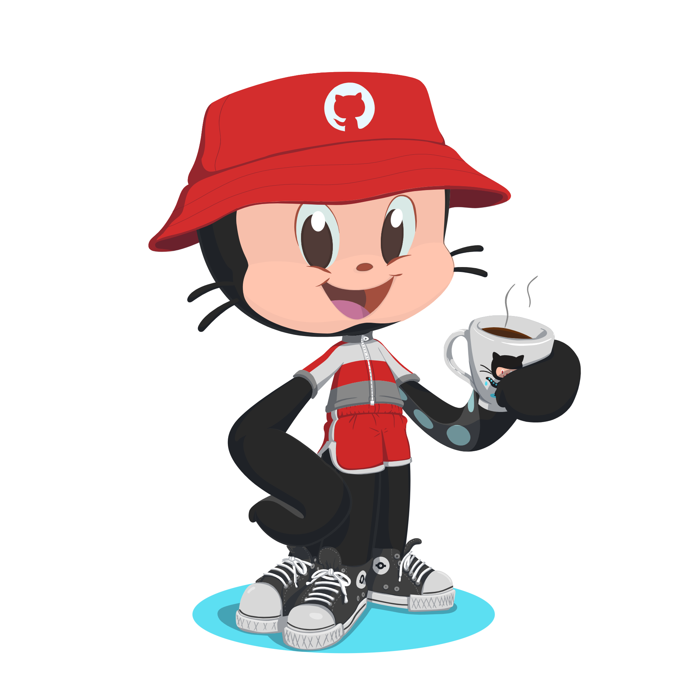

Hello ,

\begin{document}

\Huge
\textbf{I'm Yavanika}

\end{document}

<!--  -->
<!-- 
  
 -->
<h3> A passionate Data-Enthusiaist </h3>

 I’m currently learning: Data Skills
 

 Data-Fact: The largest data center in the world, covering 6.3 million square feet, is located in Langfang, China.

<!-- <h5 align= "left">🥂 Thanks for stopping by. 🥂</h5> -->

 
 
<h2>
 GitHub Trophies </h2>

<h3 align="left"> Connect with me:</h3>

<!--  -->

<h3 align="left"> Languages & Skills Stack:</h3>

  

<!-- 
    </a>      
 -->

<h2>  GitHub Stats  </h2>
<table>
  <tr>
    <th>
    
    </th>
    <th></th>
  </tr>
</table>

<!--
**balaga-yavanika/balaga-yavanika** is a ✨ _special_ ✨ repository because its `README.md` (this file) appears on your GitHub profile.

Here are some ideas to get you started:

- 🔭 I’m currently working on ...
- 🌱 I’m currently learning ...
- 👯 I’m looking to collaborate on ...
- 🤔 I’m looking for help with ...
- 💬 Ask me about ...
- 📫 How to reach me: ...
- 😄 Pronouns: ...
- ⚡ Fun fact: ...
-->
